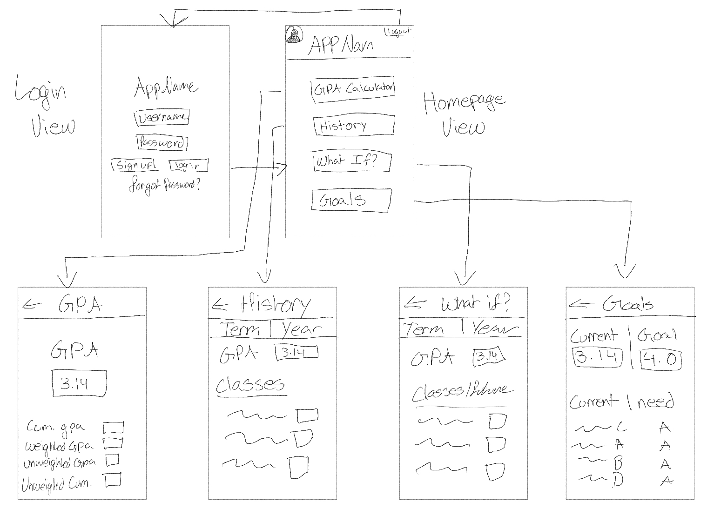

Original App Design Project - README Template
===

# GPA Calculator App

## Table of Contents

1. [Overview](#Overview)
2. [Product Spec](#Product-Spec)
3. [Wireframes](#Wireframes)
4. [Schema](#Schema)
5. [Progress Video](#Progress-Video)

## Overview

### Description

The purpose of our app is to create an app that allow FIU students to easily calculate their GPA by inserting their grades as well as course credits.

### App Evaluation

- **Category:** Education
- **Mobile:** IOS Only
- **Story:**  Allow students to easily calculate their GPA
- **Market:** FIU Students
- **Habit:** Occasional use
- **Scope:** Narrow app

## Product Spec

### 1. User Stories (Required and Optional)

**Required Must-have Stories**

* Users will be able to input their past grades and see an accurate depiction of their current GPA
* Users will be able to input potential grades for current or future courses to see what their GPA could change to
* Users will be able to track the grade for each course by implementing the weights for each class and inputting their grades

**Optional Nice-to-have Stories**

* Users will be able to create an account and access their information from multiple devices
* Users will be able to share their grades with other users
* Users will receive information on how their grade relates to others (percentile)

### 2. Screen Archetypes

- [ ] Landing Screen
* User can login
* User can signup
- [ ] Login screen
* User can login using credentials
- [ ] Sign up screen
* Users can register for a new account
- [ ] History screen
* User can view history of their past grades
- [ ] What If? Screen
* Student can enter their estimate grade to estimate their GPA
- [ ] Goals
* User can insert target GPA and required grade to achieve it
### 3. Navigation

**Tab Navigation** (Tab to Screen)

- [ ] [GPA Calculator] Lead to GPA calcualtor where grades are inserted
- [ ] [History] Demonstrates past grades that the user had and their overall GPA at the time
- [ ] [What if?] Screen that will allow user to enter their expected grade (or outcome of a particular grade for an assignment) and how it could affect their overall GPA
- [ ] [Goals] Screen that allow users to set a target GPA and show minimum grade on assigments required to achieve grade

**Flow Navigation** (Screen to Screen)

- [ ] Landing Page
  * Leads to main page if username & password is entered
  * Leads to sign up page if user needs to sign up
- [ ] Sign up page
  * Leads to main app page once an account is created

## Wireframes

### [BONUS] Digital Wireframes & Mockups

### [BONUS] Interactive Prototype

## Schema 

### Models

[Model Name, e.g., User]
| Property | Type   | Description                                  |
|----------|--------|----------------------------------------------|
| username | String | unique id for the user post (default field)   |
| password | String | user's password for login authentication      |
| ...      | ...    | ...                          

### Networking

- [List of network requests by screen]
- [Example: `[GET] /users` - to retrieve user data]
- ...
- [Add list of network requests by screen ]
- [Create basic snippets for each Parse network request]
- [OPTIONAL: List endpoints if using existing API such as Yelp]

### Progress Video

https://github.com/COP4655GroupProject8/GPACalculator/assets/122504202/3599b459-28b8-4fe6-8b58-5150dd12c569

https://github.com/COP4655GroupProject8/GPACalculator/assets/122504202/e2c96e4a-4457-4ffa-866c-e497b3146f92

